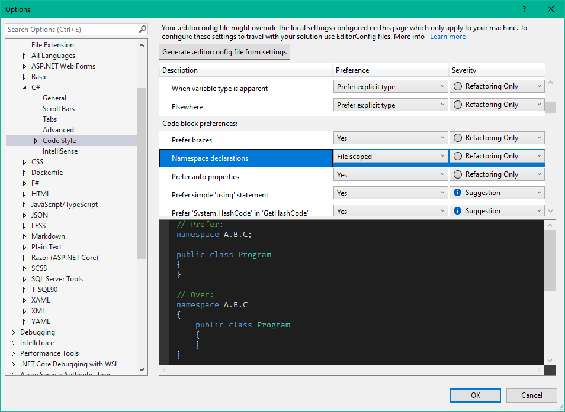

# Description

File-scoped namespace declaration allows for a simpler namespace syntax to be used to reclaim one level of indentation and some space taken up by braces as well. In practice, files do not typically contain more than one namespace scope.

Compare the difference between the new approach in [Models/FileScopedModel.cs](Models/FileScopedModel.cs) and the previous approach in [Models/IndentedModel.cs](Models/IndentedModel.cs)

# Key details

- Introduced in C# 10
- Recommended documentation
  - https://docs.microsoft.com/en-us/dotnet/csharp/whats-new/csharp-10#file-scoped-namespace-declaration

## Relevant configuration settings

The preference for which style to use with namespaces can be defined in Visual Studio in the C# code style settings at `Tools > Options > Text Editor > C# > CodeStyle > General`.



Furthermore these can be saved to an [.editorconfig](.editorconfig) file and checked in to source control to select the style on particular projects.

```
# Code-block preferences
csharp_style_namespace_declarations = file_scoped
```